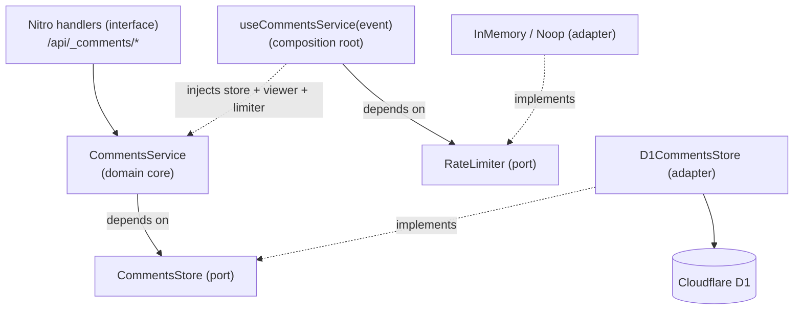

# Project Overview

`@graficos/nuxt-comments` is an embeddable, **unstyled** threaded-comments system for **Nuxt 4**, backed by
**Cloudflare D1** and authenticated through the host application's **Better Auth** setup. It ships as a
reusable Nuxt module — not a hosted widget — providing the primitives: data model, HTTP API, composables, and unstyled
components, while leaving identity to `@nuxtjs/better-auth` and presentation to the consumer.

## Repository Structure

- `src/` — the published module: `module.ts`, shared types, runtime server handlers/services/repositories,
  and the Vue components/composables.
- `playground/` — Nuxt 4 app exercising the module against local D1; also hosts the Playwright e2e suite.
- `test/` — Vitest suites: `unit/`, `api/` (Miniflare D1), `nuxt/` (component env), `module/`, plus
  `helpers/` and `mocks/`.
- `migrations/` — D1 SQL migrations for the comments tables; `migrations/auth/` holds Better Auth's tables.
- `docs/` — consumer documentation and `docs/solutions/` (locally captured engineering learnings).
- `.changeset/` — Changesets config and pending release notes.
- `.github/workflows/` — `ci.yml` (lint + tests), `e2e.yml` (Playwright), `publish.yml` (Changesets release).
- `CONCEPTS.md` — shared domain vocabulary (entities, processes, status concepts).
- `ToDo.md` — prioritised backlog of follow-up work.
- Root config: `package.json`, `tsconfig.json`, `eslint.config.mjs`, `vitest.config.ts`,
  `vitest.config.node.ts`, `auth.config.ts`, `server/auth.config.ts`.

Generated/ignored (do not edit): `.nuxt/`, `dist/`, `.output/`, `playground/.nuxt/`, `playground/.output/`,
`playground/.wrangler/`, `node_modules/`.

## Build & Development Commands

Install and prepare:

```bash
pnpm install
pnpm run dev:prepare      # stub-build the module + prepare the playground
```

Local database (Cloudflare D1 via Wrangler/Miniflare):

```bash
pnpm run playground:migrate       # apply comments migrations to local D1
pnpm run playground:migrate:auth  # apply Better Auth tables to local D1
```

Run the playground:

```bash
pnpm run dev        # dev:prepare, then `nuxt dev playground` at http://localhost:3000
pnpm run dev:build  # production build of the playground
```

Quality gates:

```bash
pnpm run lint
pnpm run test             # workers-runtime + node/nuxt suites
pnpm run test:workers     # test/unit + test/api on Miniflare D1
pnpm run test:node        # test/nuxt + test/module in a Nuxt/node env
pnpm run test:watch
pnpm run test:types       # vue-tsc
pnpm run test:types:cf    # wrangler types for the test worker config
```

End-to-end (Playwright):

```bash
pnpm --dir playground exec playwright install chromium  # one-time browser download
pnpm --dir playground e2e
pnpm --dir playground e2e:ui       # interactive Playwright UI
pnpm --dir playground e2e:headed   # watch the browser
```

Package and release:

```bash
pnpm run build      # build the published module
pnpm run prepack    # same build, run automatically before pack/publish
pnpm changeset      # record a release note for a user-facing change
```

Deploy: no deploy script; the module is published automatically thanks to the changesets Github Action.

## Code Style & Conventions

- Formatting is enforced by ESLint (`@nuxt/eslint-config` flat config in `eslint.config.mjs`, with the
  `tooling` and `stylistic` features); run `pnpm run lint`.
- Source style: no semicolons, single quotes, 2-space indentation, trailing commas, short (~100-char) lines.
- Naming:
  - Vue components are `PascalCase` (`Comments.vue`, `CommentComposer.vue`); composables are `useXxx`.
  - Server handlers encode the HTTP method in the filename (`resource.get.ts`, `comment.patch.ts`).
  - Server modules use kebab-case filenames (`d1-comments-store.ts`, `comments.service.ts`).
  - DOM hooks are namespaced `data-nc-*` (e.g. `data-nc-comment-id`).
- Runtime files import explicitly from `#imports`; Nuxt auto-imports do not apply to `node_modules`-resolved
  files.
- Server-only utility alias: `#comments/server` (see `src/runtime/server/index.ts`).
- User content is plain text — **never rendered with `v-html`** for security reasons.
- Commit messages follow Conventional Commits (`feat:`, `fix:`, `docs:`, `test:`, `refactor:`); `!` marks a
  breaking change.
- User-facing changes require a Changeset; releases are automated by `.github/workflows/publish.yml`.

## Architecture Notes

The server side is **ports and adapters (hexagonal)**: a domain core that depends only on interfaces
(ports), and infrastructure implementations (adapters) that depend on those interfaces. Dependencies point
inward; implementations point outward.



- **Ports (interfaces).** `CommentsStore` (`src/runtime/server/repositories/comments-store.ts`) is the
  persistence port; `RateLimiter` (`src/runtime/server/utils/rate-limiter.ts`) keeps an infrastructure
  concern out of the core. The core defines and depends on these — never on a concrete backend. The viewer
  resolver is injected as a function dependency too.
- **Adapters (implementations).** `D1CommentsStore` implements `CommentsStore`; `InMemoryRateLimiter` /
  `NoopRateLimiter` implement `RateLimiter`. Adapters depend on the port and on infrastructure (D1), so
  dependencies point inward while implementations point outward.
- **Composition root.** `useCommentsService(event)` (`src/runtime/server/services/index.ts`) is the only
  place that knows the concrete adapters: it constructs the store, limiter and viewer resolver and injects
  them into `createCommentsService(deps)`. The service itself (`comments.service.ts`) sees only the
  `CommentsStore` interface and the injected function dependencies.
- **Auth boundary.** Better Auth resolves the viewer from the session server-side; the comments domain
  stores only an opaque `userId` (no foreign key, no copied user table).
- **HTTP API.** Thin Nitro handlers under `/api/_comments` parse input, resolve the session, and delegate to
  `CommentsService`. Routes are registered by `src/module.ts` so the consumer app has the server routes
  appended to the original's server ones.
- **Client.** `<Comments>` server-renders top-level content via `useComments` (`useAsyncData`); reactions are
  per-viewer and hydrate client-side through the batch reactions endpoint, then merge in. Mutations are
  optimistic where safe and reconciled by a refresh.

See `docs/adapters.md` for the boundary in depth.

## Testing Strategy

- **Unit / API (workers runtime).** `test/unit` and `test/api` run on `@cloudflare/vitest-plugin` with
  Miniflare D1 and the real migrations (`vitest.config.ts`, `test/apply-migrations.ts`).
  Run: `pnpm run test:workers`.
- **Component / module.** `test/nuxt` (Nuxt environment, happy-dom) and `test/module` run as Vitest projects
  (`vitest.config.node.ts`). Run: `pnpm run test:node`.
- **End-to-end.** `playground/e2e` drives a real `nuxt dev` on port 3100 with a fresh local D1 per run; specs
  cover SSR/hydration, posting, replies, reactions, erasure, and pagination.
  Run: `pnpm --dir playground e2e`.
- **Full local gate.** `pnpm run lint && pnpm run test:types && pnpm run test && pnpm --dir playground e2e`.
- **CI.** `.github/workflows/ci.yml` runs lint + `pnpm run test`; `.github/workflows/e2e.yml` installs
  Chromium and runs the Playwright suite. Both trigger on pull requests and pushes to `main`.

## Security & Compliance

- **Secrets.** `NUXT_BETTER_AUTH_SECRET` (≥32 chars), OAuth client secrets, and `PLAYGROUND_ADMIN_TOKEN` come
  from the environment; `.env*` is gitignored (only `playground/.env.example` is committed). Never commit
  secrets or expose them in the client runtime or in the session transcript in a coding harness.
- **Authorization.** Edit/delete are owner-only, enforced server-side; moderation reads `session.user.role`
  server-side and is never trusted from the client.
- **PII erasure.** `deleteCommentsUser` / `DELETE /api/_comments/users/:userId` scrub the comments domain
  only; the package stores no email or auth rows. See `docs/privacy.md`.
- **Injection safety.** Comment bodies are stored and rendered as plain text; the package never uses `v-html`.
- **No admin endpoint.** The package ships no admin HTTP route; consumers wire `deleteCommentsUser` behind
  their own auth-gated routes.
- **Rate limiting.** The default in-memory limiter is single-isolate only; use Cloudflare-native rate limiting
  in production.
- **License.** Apache-2.0 (see `LICENSE`).
- **Dependency scanning.** `> TODO:` no automated dependency/vulnerability scan is configured in CI.

## Agent Guardrails

- Do not commit unless explicitly asked; stage only intended files and never commit secrets.
- Do not edit generated artifacts: `dist/`, `.nuxt/`, `.output/`, `playground/.nuxt/`, `playground/.output/`,
  `playground/.wrangler/`.
- Keep runtime imports explicit from `#imports`; do not rely on auto-imports inside module runtime files.
- Add a Changeset for any user-facing behaviour change, and keep the package dependency-light.
- Run `pnpm run lint` and the relevant tests before declaring work done; the e2e suite must stay green.
- Required reviews / branch protection: `> TODO:` not documented in-repo (mark the **E2E** check required in
  GitHub branch protection).

## Extensibility Hooks

Module options (`comments` key in `nuxt.config`; see `src/types.ts`):

| Option                                       | Default              | Purpose                                       |
| -------------------------------------------- | -------------------- | --------------------------------------------- |
| `database.binding`                           | `'DB'`               | D1 binding for the comments tables.           |
| `auth.database.binding`                      | –                    | Opt-in D1 persistence for Better Auth tables. |
| `auth.adminRole`                             | `'admin'`            | Server-only role granting moderation erasure. |
| `pagination.pageSize` / `maxPageSize`        | `20` / `100`         | List page size and cap.                       |
| `reactions.enabled` / `types`                | `true` / `['like']`  | Toggle reactions and allow types.             |
| `limits.maxBodyLength` / `maxResourceLength` | `4000` / `512`       | Input bounds.                                 |
| `components.prefix`                          | `'Nuxt'`             | Component name prefix (`''` ⇒ `<Comments>`).  |
| `messages`                                   | English defaults     | Override any UI string / `aria-label` (i18n). |
| `rateLimiter` / `rateLimiterTrustProxy`      | `'memory'` / `false` | Mutation rate limiting.                       |

Other extension points:

- **Store adapter.** Implement `CommentsStore` (`src/runtime/server/repositories/comments-store.ts`) for a
  non-D1 backend; D1 is the shipped implementation.
- **Server exports.** `#comments/server` exposes `deleteCommentsUser`, `getCommentsStore`,
  `useCommentsService`, the rate limiters, and error helpers.
- **UI.** Slots and per-layer `classes` props on the components; provider names are consumer-owned.
- **Env vars.** `NUXT_PUBLIC_SITE_URL`, `NUXT_BETTER_AUTH_SECRET`, `PLAYGROUND_ADMIN_TOKEN`, and optional
  OAuth credentials.
- **Auth adapter seam.** `> TODO:` planned (see `ToDo.md`); today the module is wired to
  `@nuxtjs/better-auth`.

## Further Reading

- [README.md](./README.md) — overview, install, minimal setup.
- [docs/configuration.md](./docs/configuration.md) — module options and runtime config.
- [docs/api.md](./docs/api.md) — HTTP endpoints, validation, deletion policy.
- [docs/components.md](./docs/components.md) — component props/slots/events and composables.
- [docs/authentication.md](./docs/authentication.md) — Better Auth integration and providers.
- [docs/cloudflare-d1.md](./docs/cloudflare-d1.md) — D1 setup, migrations, deployment.
- [docs/privacy.md](./docs/privacy.md) — stored personal data and erasure.
- [docs/adapters.md](./docs/adapters.md) — the `CommentsStore` boundary.
- [playground/README.md](./playground/README.md) — running the demo and e2e tests.
- [CONCEPTS.md](./CONCEPTS.md) — shared domain vocabulary.
- [ToDo.md](./ToDo.md) — prioritised follow-up work.
- [docs/solutions/](./docs/solutions/) — captured engineering learnings.
